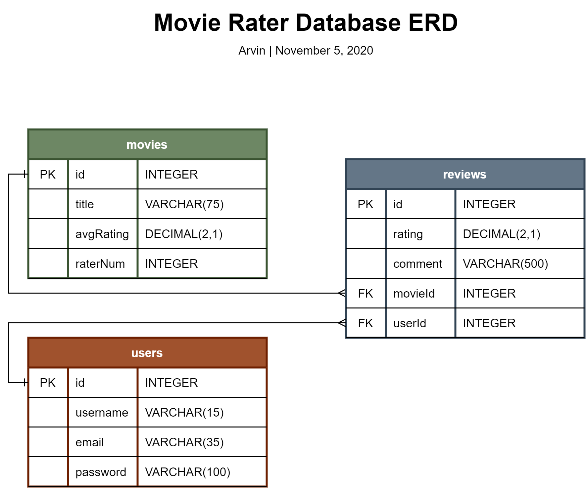

# Movie Rater Rest Api

### Implementation
- GoFiber
- MySQL
- JWT

### Features
- Registration</br>
    > |Http Method    |Endpoint               |
    > |-              |-                      |
    > |POST           |/api/register          |
    > A public endpoint for registration. Requires JSON in the body which contains:
    > - username
    > - email
    > - password
    >
    > It will return a JSON thatcontains:
    > - accessToken
    > - refreshToken
    > - username
    > - email
    
- Login</br>
    > |Http Method    |Endpoint               |
    > |-              |-                      |
    > |POST           |/api/login             |
    > A public endpoint for login. Requires JSON in the body which contains:
    > - email
    > - password
    >
    > It will return a JSON of:
    > - accessToken
    > - refreshToken
    > - username
    > - email

- Authentication</br>
    > |Http Method    |Endpoint               |
    > |-              |-                      |
    > |GET            |/api/refresh           |
    > A private endpoint that is used to authenticate user, it requires a refresh token in the header with bearer 'Bearer'. If the refresh token is valid, it will create new access and refresh tokens and return a JSON that contains:
    > - accessToken
    > - refreshToken

- Get Movies</br>
    > |Http Method    |Endpoint               |
    > |-              |-                      |
    > |GET            |/api/movies            |
    > A private endpoint that is used for getting list of movies from the database, it requires an access token in the header with bearer 'Bearer'. If the token is valid, it will return a list of JSONs. Each of the JSON contains:
    > - ID
    > - Title
    > - AvgRating

- Create Movie</br>
    > |Http Method    |Endpoint               |
    > |-              |-                      |
    > |POST           |/api/movie             |
    > A private endpoint that is used for creating a movie, it requires an access token in the header with bearer 'Bearer' and a JSON in the body which contains:
    > - title

- Get Reviews</br>
    > |Http Method    |Endpoint               |
    > |-              |-                      |
    > |GET            |/api/reviews/:id       |
    > A private endpoint that is used for getting list of reviews of a specific movie, it requires an access token in the header with bearer 'Bearer'. The :id section in the endpoint must be filled with a valid / existing movie id. It then will return a JSON that contains:
    > - ID
    > - Rating
    > - Comment
    > - Username

- Create Review</br>
    > |Http Method    |Endpoint               |
    > |-              |-                      |
    > |POST           |/api/review/:id        |
    > A private endpoint that is used to create a review, it requires an access token in the header with bearer 'Bearer' and a JSON in the body which contains:
    > - rating
    > - comment
    >
    > The :id section in the endpoint must be filled with a valid / existing movie id.

### ERD


### MySQL Setup
```mysql
# Create User
CREATE USER 'test'@'localhost' IDENTIFIED BY 'Test@1234';

# Create movie_rater Database
CREATE DATABASE movie_rater;
USE movie_rater;

# movies Table
CREATE TABLE movies(
	id INTEGER UNSIGNED AUTO_INCREMENT,
   	title VARCHAR(75) NOT NULL,
    avgRating DECIMAL(2,1) NOT NULL DEFAULT 0.0 CHECK(avgRating BETWEEN 0.0 AND 5.0),
    raterNum INTEGER UNSIGNED NOT NULL DEFAULT 0,
    CONSTRAINT id_pk PRIMARY KEY(id)
);

# users Table
CREATE TABLE users(
    id INTEGER UNSIGNED AUTO_INCREMENT,
    username VARCHAR(15) NOT NULL,
    email VARCHAR(35) NOT NULL,
    password VARCHAR(100) NOT NULL,
    CONSTRAINT id_pk PRIMARY KEY(id)
);

# reviews Table
CREATE TABLE reviews(
	id INTEGER UNSIGNED AUTO_INCREMENT,
    rating INTEGER UNSIGNED NOT NULL DEFAULT 0 CHECK(rating BETWEEN 0 AND 5),
    comment VARCHAR(500),
    movieId INTEGER UNSIGNED NOT NULL,
    userId INTEGER UNSIGNED NOT NULL,
    CONSTRAINT id_pk PRIMARY KEY(id),
    CONSTRAINT movieId_fk FOREIGN KEY(movieId) REFERENCES movies(id)
    	ON DELETE CASCADE
    	ON UPDATE RESTRICT,
    CONSTRAINT userId_fk FOREIGN KEY(userId) REFERENCES users(id)
    	ON DELETE CASCADE
    	ON UPDATE RESTRICT
);
```

